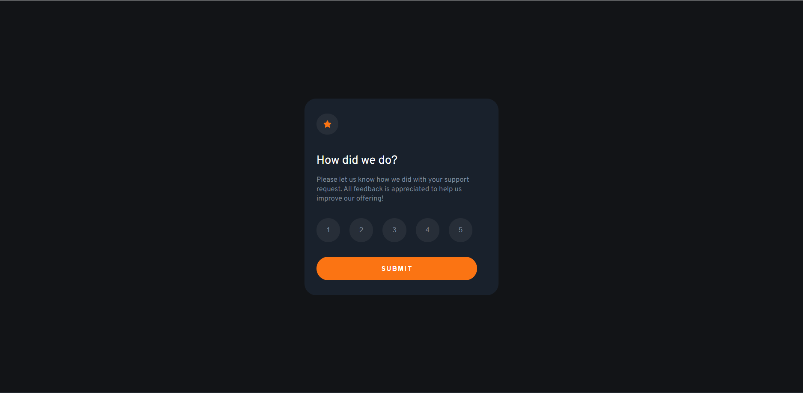

# Frontend Mentor - Interactive rating component solution

This is a solution to the [Interactive rating component challenge on Frontend Mentor](https://www.frontendmentor.io/challenges/interactive-rating-component-koxpeBUmI). Frontend Mentor challenges help you improve your coding skills by building realistic projects. 

## Table of contents

- [Overview](#overview)
  - [The challenge](#the-challenge)
  - [Screenshot](#screenshot)
  - [Links](#links)
- [Built with](#built-with)
- [Author](#author)

## Overview

### The challenge

Users should be able to:

- View the optimal layout for the app depending on their device's screen size (WIP)
- See hover states for all interactive elements on the page
- Select and submit a number rating
- See the "Thank you" card state after submitting a rating (WIP)

### Screenshot

### Links

- Solution URL: [frontendmentor.io/solutions](https://www.frontendmentor.io/solutions/interactive-rating-component-S6jRp6X3s6)
- Live Site URL: [weberowsky.github.io](https://weberowsky.github.io/Interactive-Rating-Component/)

### Built with

- Semantic HTML5 markup
- CSS custom properties
- Flexbox
- Vanilla JS

## Author

- Website - [Weberowsky](https://weberowsky.space)
- Frontend Mentor - [@weberowsky](https://www.frontendmentor.io/profile/weberowsky)

